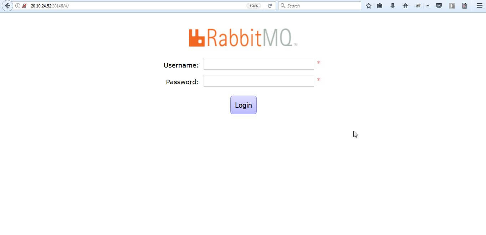
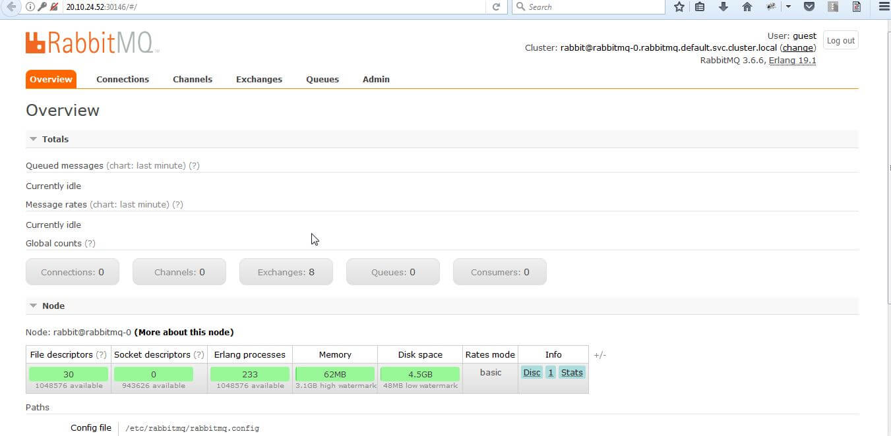

------

## Deploying RabbitMQ as a StatefulSet

This section provides detailed instructions on how to run a RabbitMQ pod on OpenEBS storage in a Kubernetes cluster.

We are using OpenEBS cStor storage engine for running RabbitMQ as a StatefulSet. Before starting, check the status of the cluster using the following command. 

```
kubectl get nodes
```

The following output shows the status of the nodes in the cluster.

```
NAME                                         STATUS    ROLES     AGE       VERSION
gke-ranjith-080-default-pool-1c852599-k5wb   Ready     <none>    4h        v1.9.7-gke.11
gke-ranjith-080-default-pool-1c852599-nn87   Ready     <none>    4h        v1.9.7-gke.11
gke-ranjith-080-default-pool-1c852599-tgfv   Ready     <none>    4h        v1.9.7-gke.11
```

Also make sure that you have deployed OpenEBS in your cluster. If not deployed, you can install from [here](/docs/next/quickstartguide.html).

You can check the status of OpenEBS pods by running following command.

```
kubectl get pod -n openebs
```

Output of above command will be similar to the following.

```
NAME                                        READY     STATUS    RESTARTS   AGE
cstor-sparse-pool-c7dq-7ff4479554-68xht     2/2       Running   0          3h
cstor-sparse-pool-ny1l-7d7987974d-p2vmw     2/2       Running   0          3h
cstor-sparse-pool-r8lv-8599d46c4d-v8cql     2/2       Running   0          3h
maya-apiserver-7bc857bb44-l57q2             1/1       Running   0          3h
openebs-ndm-5mlr2                           1/1       Running   0          3h
openebs-ndm-5w6k4                           1/1       Running   0          3h
openebs-ndm-g8tvd                           1/1       Running   0          3h
openebs-provisioner-b9fb58d6d-qzjfd         1/1       Running   0          3h
openebs-snapshot-operator-bb5697c8d-xmrxs   2/2       Running   0          3h
```

Download the following files from OpenEBS repo and change the **volume.beta.kubernetes.io/storage-class** under **volumeClaimTemplates** -> ***metadata***-> **annotations** from *openebs-jiva-default* to *openebs-cstor-sparse*. 

```
wget https://raw.githubusercontent.com/openebs/openebs/master/k8s/demo/rabbitmq/rabbitmq-statefulset.yaml
wget https://raw.githubusercontent.com/openebs/openebs/master/k8s/demo/rabbitmq/run.sh
```

After the modification on the downloaded files, you can run following commands to install the RabbitMQ on cStor volume.

```
sh run.sh
```
Running the above command creates the persistent volume claim, deployment, and a service for the RabbitMQ application. Check if the RabbitMQ pods status by running the following command.

```
kubectl get pods 
```
Output of above command will be similar to the following.

```
NAME         READY     STATUS    RESTARTS   AGE
rabbitmq-0   1/1       Running   0          10m
rabbitmq-1   1/1       Running   0          7m
rabbitmq-2   1/1       Running   0          3m
```

To obtain the status of underlying persistent volumes used by RabbitMQ, run the following command.

```
kubectl get pvc
```
Output of above command will be similar to the following.

```
NAME                  STATUS    VOLUME                                     CAPACITY   ACCESS MODES   STORAGECLASS           AGE
rabbitmq-rabbitmq-0   Bound     pvc-c9965099-f93b-11e8-ad55-42010a800222   5G         RWO            openebs-cstor-sparse   11m
rabbitmq-rabbitmq-1   Bound     pvc-3a370815-f93c-11e8-ad55-42010a800222   5G         RWO            openebs-cstor-sparse   7m
rabbitmq-rabbitmq-2   Bound     pvc-bb888b4d-f93c-11e8-ad55-42010a800222   5G         RWO            openebs-cstor-sparse   4m
```

Check the status of the RabbitMQ service by running the following command.

```
kubectl get svc
```
Output of above command will be similar to the following.

```
NAME                  TYPE        CLUSTER-IP      EXTERNAL-IP   PORT(S)                       AGE
kubernetes            ClusterIP   10.79.240.1     <none>        443/TCP                       4h
rabbitmq              ClusterIP   None            <none>        5672/TCP,4369/TCP,25672/TCP   11m
rabbitmq-management   NodePort    10.79.240.102   <none>        15672:30983/TCP               11m
```

### Launching  RabbitMQ

The RabbitMQ deployment YAML, creates a NodePort service type to make RabbitMQ accessible outside the cluster. You can follow the below steps to launch the RabbitMQ.

1. Get the public or external IP of the node where RabbitMQ is running. Using the below command, you can get the details of Node where RabbitMQ pos are running.

   ```
   kubectl get pod -o wide
   ```

   Output of above command will be similar to the following.

   ```
   NAME         READY     STATUS    RESTARTS   AGE       IP           NODE                                         NOMINATED NODE
   rabbitmq-0   1/1       Running   0          15m       10.76.1.27   gke-ranjith-080-default-pool-1c852599-nn87   <none>
   rabbitmq-1   1/1       Running   0          12m       10.76.2.19   gke-ranjith-080-default-pool-1c852599-tgfv   <none>
   rabbitmq-2   1/1       Running   0          9m        10.76.0.19   gke-ranjith-080-default-pool-1c852599-k5wb   <none>
   ```

   Once you get the Node details, you can get the External IP of the Node using the following command.

   ```
   kubectl get nodes -o wide
   ```

   Output of above command will be similar to the following.

   ```
   NAME                                         STATUS    ROLES     AGE       VERSION         INTERNAL-IP   EXTERNAL-IP      OS-IMAGE             KERNEL-VERSION    CONTAINER-RUNTIME
   gke-ranjith-080-default-pool-1c852599-k5wb   Ready     <none>    4h        v1.9.7-gke.11   10.128.0.27   35.202.55.171    Ubuntu 16.04.5 LTS   4.15.0-1017-gcp   docker://17.3.2
   gke-ranjith-080-default-pool-1c852599-nn87   Ready     <none>    4h        v1.9.7-gke.11   10.128.0.28   35.226.229.246   Ubuntu 16.04.5 LTS   4.15.0-1017-gcp   docker://17.3.2
   gke-ranjith-080-default-pool-1c852599-tgfv   Ready     <none>    4h        v1.9.7-gke.11   10.128.0.26   35.232.97.32     Ubuntu 16.04.5 LTS   4.15.0-1017-gcp   docker://17.3.2
   ```

2. In the above example, RabbitMQ is running on the all the 3 Nodes. So, you can take any of the Node. For Example, take the first Node External IP address 35.202.55.171  from the listed output. 

2. Get the port number from the RabbitMQ service using the following command.

   ```
   kubectl describe svc rabbitmq-management | grep NodePort:
   ```

   Output of above command will be similar to the following.

   ```
   NodePort:                 http  30983/TCP
   ```

3. After getting the Node IP and Port, go to the browser and type the URL as **_https:// External node_IP :NodePort_** and perform the following procedure from the UI.

   **Example:**

   http://35.202.55.171:30983

   **Note:** To reach the above URL, you may need to disable firewall on the node.

4. Access the above URL from the web browser. The following screen will appear. 
  

5. Enter the username/password to login (Default is guest/guest). The following screen will appear once you login to RabbitMQ.

   


<!-- Hotjar Tracking Code for https://docs.openebs.io -->
<script>
   (function(h,o,t,j,a,r){
       h.hj=h.hj||function(){(h.hj.q=h.hj.q||[]).push(arguments)};
       h._hjSettings={hjid:785693,hjsv:6};
       a=o.getElementsByTagName('head')[0];
       r=o.createElement('script');r.async=1;
       r.src=t+h._hjSettings.hjid+j+h._hjSettings.hjsv;
       a.appendChild(r);
   })(window,document,'https://static.hotjar.com/c/hotjar-','.js?sv=');
</script>

<!-- Global site tag (gtag.js) - Google Analytics -->
<script async src="https://www.googletagmanager.com/gtag/js?id=UA-92076314-12"></script>
<script>
  window.dataLayer = window.dataLayer || [];
  function gtag(){dataLayer.push(arguments);}
  gtag('js', new Date());

  gtag('config', 'UA-92076314-12');
</script>
